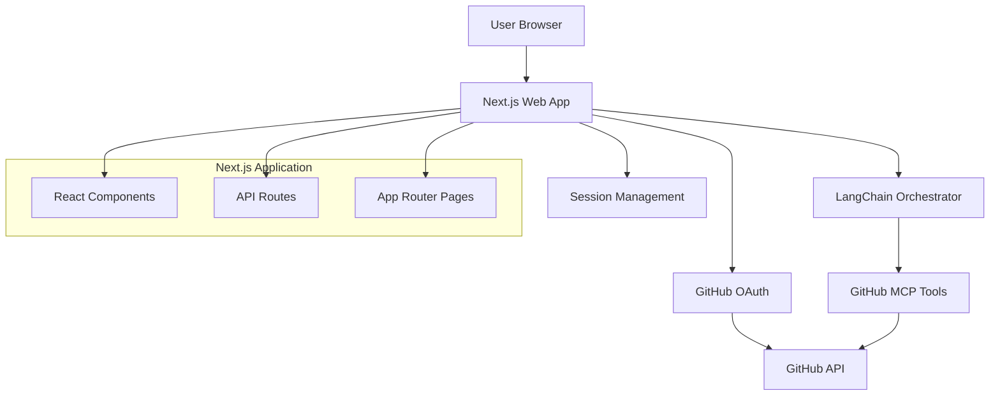

# Design Document

## Overview

The GitHub Developer Wiki is a Next.js-based web application that provides Wikipedia-like functionality for exploring GitHub repositories. The system supports both authenticated and anonymous access, uses LangChain as the orchestration layer to coordinate between user queries and GitHub MCP (Model Context Protocol) for repository data access. This architecture enables intelligent querying, contextual understanding, and seamless integration with GitHub's API ecosystem while providing secure access to both public and private repositories.

## Architecture

### High-Level Architecture



### Component Layers

1. **Frontend**: Next.js React components with authentication and repository selection
2. **Authentication**: GitHub OAuth integration with session management
3. **Orchestrator**: LangChain determines which GitHub MCP tools to call based on user queries
4. **Data Access**: GitHub MCP tools provide repository data with user authentication context

## Components and Interfaces

### Frontend Components

#### Authentication Component
- **Purpose**: Handle GitHub OAuth login/logout and anonymous access
- **Features**: Login button, user profile display, logout functionality
- **State**: Authentication status, user information, loading states

#### Repository Selection Component
- **Purpose**: Allow users to select repositories via URL input or repository list
- **Features**: Repository URL input, personal repository list (if authenticated), search/filter
- **State**: Available repositories, selected repository, search filters

#### Main Query Interface Component
- **Purpose**: Primary interface for asking questions about repositories
- **Features**: Query text area, response display with code highlighting, conversation history
- **State**: Current repository, query history, loading states, conversation context

### Backend API Routes

#### `/api/auth/github`
- **Method**: GET
- **Purpose**: Initiate GitHub OAuth flow
- **Integration**: NextAuth.js GitHub provider
- **Implementation**: Functional API route handlers

#### `/api/auth/callback/github`
- **Method**: GET
- **Purpose**: Handle GitHub OAuth callback and token exchange
- **Integration**: NextAuth.js callback handling
- **Implementation**: Functional callback processing

#### `/api/repositories`
- **Method**: GET
- **Purpose**: Fetch user's accessible repositories (authenticated users only)
- **Output**: `{ repositories: Repository[] }`
- **Integration**: Functional GitHub MCP service calls with user authentication

#### `/api/query`
- **Method**: POST
- **Purpose**: Handles all repository queries through LangChain orchestrator
- **Input**: `{ repositoryUrl: string, query: string, userToken?: string }`
- **Output**: `{ response: string, sources: string[], codeReferences?: CodeReference[] }`
- **Integration**: Functional composition of LangChain and GitHub MCP services

### LangChain Orchestration Layer

#### Query Processing Functions
- **processQuery()**: Main orchestration function that analyzes user queries using configured LLM
- **determineMCPTools()**: Function to decide which GitHub MCP tools to call based on query analysis
- **formatResponse()**: Function to process MCP results into readable response format
- **LLM Integration**: Functional approach supporting OpenAI GPT-4, Anthropic Claude, and OpenRouter models
- **Key MCP Functions Used**:
  - `getFileContents()` - For file-specific questions
  - `searchCode()` - For code pattern searches
  - `getPullRequestFiles()` - For understanding recent changes
  - `searchRepositories()` - For finding related projects

### Functional Architecture Principles

All services and utilities follow functional programming patterns:
- **Pure Functions**: Predictable inputs and outputs without side effects
- **Immutable Data**: Configuration and state passed as parameters
- **Composition**: Complex functionality built by composing simpler functions
- **No Classes**: All implementations use functional modules instead of class-based patterns

### User-Provided LLM Configuration

#### Configuration Flow
1. **Post-Authentication Setup**: After GitHub OAuth, users configure their LLM provider
2. **Provider Selection**: Users choose between OpenAI GPT-4 or Anthropic Claude
3. **API Key Entry**: Secure form for API key input with validation
4. **Encrypted Storage**: Keys stored encrypted in user session/database
5. **Usage Tracking**: Optional usage monitoring for user awareness

#### Security Implementation
- **Encryption**: API keys encrypted using AES-256 before storage
- **Session-Based**: Keys stored in secure HTTP-only cookies or encrypted database
- **No Server Logs**: API keys never logged or exposed in server logs
- **Key Validation**: Real-time validation of API keys during setup

#### Supported Providers
- **OpenAI**: GPT-4, GPT-4-turbo, GPT-3.5-turbo models
- **Anthropic**: Claude-3 Sonnet, Claude-3 Haiku, Claude-3 Opus models
- **OpenRouter**: Access to 100+ models including:
  - Meta Llama models (Llama-2, Llama-3)
  - Mistral models (Mistral-7B, Mixtral-8x7B)
  - Google models (Gemini Pro, PaLM)
  - Cohere models (Command, Command-Light)
  - Open source models at competitive pricing
- **Benefits of OpenRouter**: Single API for multiple providers, competitive pricing, model diversity

## Data Models

### User Session
```typescript
interface UserSession {
  user: {
    id: string;
    login: string;
    name: string;
    avatar_url: string;
  };
  accessToken: string;
  expiresAt: number;
  llmConfig?: {
    provider: 'openai' | 'anthropic' | 'openrouter';
    encryptedApiKey: string;
    model: string;
    baseUrl?: string; // For OpenRouter custom endpoint
    configuredAt: Date;
  };
}
```

### Repository
```typescript
interface Repository {
  id: number;
  name: string;
  full_name: string;
  owner: {
    login: string;
    avatar_url: string;
  };
  description: string;
  private: boolean;
  html_url: string;
  updated_at: string;
  language: string;
}
```

### QueryRequest
```typescript
interface QueryRequest {
  repositoryUrl: string;
  query: string;
  userToken?: string;
}
```

### QueryResponse
```typescript
interface QueryResponse {
  response: string;
  sources: string[];
  codeReferences?: CodeReference[];
}
```

### CodeReference
```typescript
interface CodeReference {
  file: string;
  startLine: number;
  endLine: number;
  content: string;
  url: string;
}
```

### LLM Configuration Setup
```typescript
interface LLMSetupRequest {
  provider: 'openai' | 'anthropic' | 'openrouter';
  apiKey: string;
  model?: string; // Optional, defaults to provider's recommended model
  baseUrl?: string; // For OpenRouter: https://openrouter.ai/api/v1
}
```

### OpenRouter Model Selection
```typescript
interface OpenRouterModel {
  id: string;
  name: string;
  description: string;
  pricing: {
    prompt: number;
    completion: number;
  };
  context_length: number;
  architecture: {
    modality: string;
    tokenizer: string;
    instruct_type?: string;
  };
}
```

### LLM Configuration Response
```typescript
interface LLMSetupResponse {
  success: boolean;
  provider: string;
  model: string;
  keyValid: boolean;
  availableModels?: OpenRouterModel[]; // For OpenRouter
  error?: string;
}
```

### Query Processing Context
```typescript
interface QueryContext {
  repository: string;
  userLLMConfig: {
    provider: 'openai' | 'anthropic' | 'openrouter';
    apiKey: string; // Decrypted for processing
    model: string;
    baseUrl?: string;
  };
  githubToken: string;
  query: string;
}
```

## Error Handling

### Authentication Error Handling
- **OAuth Failures**: Display authentication error with retry option
- **Token Expiration**: Automatic token refresh or re-authentication prompt
- **Permission Denied**: Clear message about repository access requirements

### Repository Access Error Handling
- **Invalid Repository URL**: Display error message with format guidance
- **Private Repository Access**: Prompt for authentication if user is anonymous
- **Repository Not Found**: Clear error message with suggestions

### GitHub MCP Error Handling
- **Rate Limit Exceeded**: Display wait time and suggest authentication for higher limits
- **MCP Tool Failures**: Return error message to user with retry option
- **Network Issues**: Display connection error with retry option
- **Large Repository Warnings**: Inform user about potential delays for large repositories

### LangChain Integration Error Handling
- **Query Processing Failures**: Graceful fallback with basic repository information
- **Context Size Limits**: Intelligent truncation of repository context
- **AI Service Unavailability**: Clear error message with alternative suggestions

