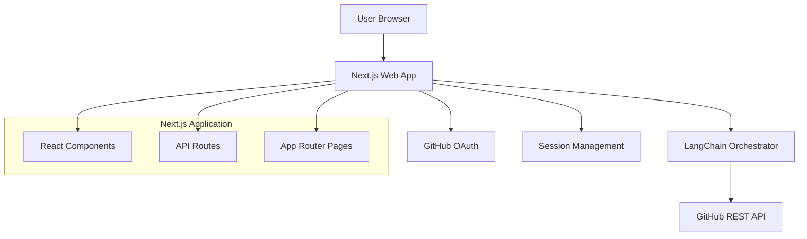

# GitHub Developer Wiki (Githubpedia)

A Next.js application that provides Wikipedia-like functionality for exploring GitHub repositories through AI-powered chat and intelligent code analysis. The system leverages GitHub's REST API with LangChain orchestration to provide contextual answers about codebases, supporting authenticated access for both public and private repositories.

## 🚀 Live Demo

**Production URL**: https://githubpedia.vercel.app/

## 🏗️ System Architecture

### High-Level Overview

The GitHub Developer Wiki is built on a modern, functional architecture that combines Next.js 15 with AI orchestration to provide intelligent repository exploration:



### Core Components

#### 1. **Authentication Layer**

- **GitHub OAuth Integration**: Secure authentication using NextAuth.js
- **Session Management**: Encrypted session storage with GitHub access tokens
- **Permission Handling**: Automatic access to user's public and private repositories

#### 2. **AI Orchestration Layer**

- **Multi-Provider LLM Support**: OpenAI GPT-4, Anthropic Claude, and OpenRouter
- **LangChain Integration**: Intelligent query processing and context management
- **User-Controlled AI**: Users provide their own API keys for full control over costs and usage

#### 3. **GitHub Integration Layer**

- **Direct REST API**: Production-ready GitHub API integration (no MCP dependency)
- **Intelligent Context Retrieval**: Smart file selection based on query relevance
- **Comprehensive Repository Analysis**: Code structure, dependencies, and patterns

#### 4. **Frontend Interface**

- **Modern React UI**: Built with Next.js 15 App Router and TypeScript
- **Thread-Based Conversations**: Persistent chat history with repository context
- **Real-Time Code Highlighting**: Syntax highlighting for code snippets and references

### Functional Architecture Principles

The entire codebase follows strict functional programming patterns:

- **Pure Functions**: All services use predictable inputs/outputs without side effects
- **Immutable Data**: Configuration and state passed as parameters, never mutated
- **Function Composition**: Complex functionality built by composing simpler functions
- **No Classes**: All implementations use functional modules instead of class-based patterns
- **Type Safety**: Comprehensive TypeScript with no `any` types allowed

## 🔧 Technology Stack

### Core Technologies

- **Framework**: Next.js 15 with App Router
- **Language**: TypeScript 5+ with strict type checking
- **Styling**: Tailwind CSS 4
- **Authentication**: NextAuth.js with GitHub OAuth
- **AI Integration**: LangChain with multi-provider support

### AI & ML

- **LangChain**: Query orchestration and context management
- **OpenAI**: GPT-4, GPT-4-turbo, GPT-3.5-turbo models
- **Anthropic**: Claude-3 Sonnet, Haiku, and Opus models
- **OpenRouter**: Access to 100+ models including Llama, Mistral, Gemini, and more

### Development & Deployment

- **Package Manager**: npm with lock file
- **Code Quality**: ESLint, Prettier with import sorting
- **Deployment**: Vercel with automatic CI/CD
- **Environment**: Node.js with serverless functions

## 📁 Project Structure

```
src/
├── app/                    # Next.js App Router
│   ├── api/               # API routes (serverless functions)
│   │   ├── auth/          # NextAuth.js authentication
│   │   ├── llm-setup/     # LLM configuration endpoints
│   │   └── query/         # Main query processing
│   ├── auth/              # Authentication pages
│   ├── chat/              # Main chat interface
│   └── llm-setup/         # LLM provider configuration
├── components/            # React components
│   ├── auth-button.tsx    # GitHub OAuth button
│   ├── ChatInterface.tsx  # Main chat interface
│   ├── ChatWindow.tsx     # Individual chat window
│   ├── LLMSetup.tsx       # AI provider setup
│   └── ...               # Additional UI components
├── services/              # Business logic (functional)
│   ├── llmService.ts      # Multi-provider LLM management
│   ├── mcpService.ts      # GitHub API integration
│   └── queryService.ts    # LangChain orchestration
├── types/                 # TypeScript type definitions
│   ├── auth.ts           # Authentication types
│   ├── github.ts         # GitHub API types
│   ├── llm.ts            # LLM provider types
│   └── query.ts          # Query processing types
└── utils/                 # Utility functions
    ├── auth.ts           # Authentication helpers
    ├── encryption.ts     # API key encryption
    ├── githubUtils.ts    # GitHub URL parsing
    └── llmConfig.ts      # LLM configuration
```

## 🚀 Getting Started

### Prerequisites

1. **Node.js 18+** and npm
2. **GitHub Account** for OAuth and API access
3. **AI Provider Account** (OpenAI, Anthropic, or OpenRouter)

### Installation

1. **Clone the repository**:

   ```bash
   git clone <repository-url>
   cd githubpedia
   ```

2. **Install dependencies**:

   ```bash
   npm install
   ```

3. **Set up environment variables**:

   ```bash
   cp .env.local.example .env.local
   ```

4. **Configure environment variables** in `.env.local`:

   ```env
   # GitHub Personal Access Token
   GITHUB_TOKEN=your_github_personal_access_token

   # GitHub OAuth App Credentials
   GITHUB_CLIENT_ID=your_github_oauth_client_id
   GITHUB_CLIENT_SECRET=your_github_oauth_client_secret

   # NextAuth Configuration
   NEXTAUTH_SECRET=your_nextauth_secret
   NEXTAUTH_URL=http://localhost:3000

   # Encryption Secret (32 characters)
   ENCRYPTION_SECRET=your_32_character_encryption_secret
   ```

5. **Run the development server**:

   ```bash
   npm run dev
   ```

6. **Open your browser** to [http://localhost:3000](http://localhost:3000)

### GitHub OAuth Setup

1. Go to [GitHub Developer Settings](https://github.com/settings/developers)
2. Create a new OAuth App with:
   - **Homepage URL**: `http://localhost:3000`
   - **Authorization callback URL**: `http://localhost:3000/api/auth/callback/github`
3. Copy the Client ID and Client Secret to your `.env.local`

## 🎯 Key Features

### 1. **Intelligent Repository Analysis**

- **Smart Context Retrieval**: Automatically identifies and analyzes relevant code files
- **Architecture Understanding**: Recognizes design patterns, frameworks, and dependencies
- **Code Pattern Search**: Finds and explains implementation patterns across the codebase

### 2. **Multi-Provider AI Support**

- **OpenAI Integration**: GPT-4, GPT-4-turbo, and GPT-3.5-turbo models
- **Anthropic Claude**: Claude-3 Sonnet, Haiku, and Opus models
- **OpenRouter Access**: 100+ models including Llama, Mistral, Gemini, and open-source options
- **User-Controlled**: Users provide their own API keys for cost control and privacy

### 3. **Advanced Query Processing**

- **LangChain Orchestration**: Intelligent query analysis and tool selection
- **Context-Aware Responses**: Answers include relevant code snippets and file references
- **Conversation Memory**: Maintains context across multiple queries in a thread

### 4. **Secure Authentication**

- **GitHub OAuth**: Secure access to public and private repositories
- **Encrypted Storage**: API keys encrypted using AES-256 encryption
- **Session Management**: Secure session handling with automatic token refresh

### 5. **Modern User Interface**

- **Thread-Based Chat**: Organize conversations by repository or topic
- **Code Highlighting**: Syntax highlighting for all supported languages
- **Responsive Design**: Works seamlessly on desktop and mobile devices
- **Real-Time Updates**: Live query processing with loading states

## 🔒 Security & Privacy

### Data Protection

- **API Key Encryption**: All user API keys encrypted with AES-256
- **No Server Logging**: API keys never logged or exposed in server logs
- **Session Security**: HTTP-only cookies with secure session management
- **HTTPS Enforcement**: All production traffic encrypted in transit

### GitHub Integration

- **OAuth Security**: Secure GitHub authentication with proper scope management
- **Token Management**: Automatic token refresh and expiration handling
- **Permission Respect**: Only accesses repositories user has permission to view

### AI Provider Security

- **User-Controlled Keys**: Users provide their own API keys for full control
- **No Key Storage**: API keys stored encrypted and only in user sessions
- **Provider Isolation**: Each user's AI requests use their own credentials

## 📊 Data Models

### Core Types

```typescript
// User session with encrypted LLM configuration
interface UserSession {
  user: {
    id: string;
    login: string;
    name: string;
    avatar_url: string;
  };
  accessToken: string;
  expiresAt: number;
  llmConfig?: {
    provider: 'openai' | 'anthropic' | 'openrouter';
    encryptedApiKey: string;
    model: string;
    baseUrl?: string;
    configuredAt: Date;
  };
}

// Query processing context
interface QueryContext {
  repository: { owner: string; repo: string };
  query: string;
  githubToken: string;
  llmConfig: {
    provider: LLMProvider;
    apiKey: string;
    model: string;
    baseUrl?: string;
  };
}

// Query response with code references
interface QueryResponse {
  response: string;
  sources: string[];
  codeReferences?: CodeReference[];
}
```

## 🛠️ Development

### Code Quality

```bash
# Linting
npm run lint
npm run lint:fix

# Formatting
npm run format
npm run format:check
```

### Testing

The application includes comprehensive error handling and validation:

- **API Validation**: All endpoints validate inputs and handle errors gracefully
- **Type Safety**: Strict TypeScript configuration prevents runtime type errors
- **Error Boundaries**: React error boundaries catch and handle UI errors

### Performance Optimization

- **Serverless Functions**: API routes optimized for Vercel's serverless environment
- **Code Splitting**: Automatic code splitting with Next.js App Router
- **Caching**: Intelligent caching of repository data and AI responses
- **Rate Limiting**: Built-in GitHub API rate limit handling

## 🚀 Deployment

### Production Deployment

The application is optimized for deployment on Vercel with automatic CI/CD:

```bash
# Deploy to preview environment
npm run deploy:preview

# Deploy to production
npm run deploy
```

### Environment Variables

Configure these environment variables in your deployment platform:

```env
# GitHub Integration
GITHUB_TOKEN=your_github_personal_access_token
GITHUB_CLIENT_ID=your_github_oauth_client_id
GITHUB_CLIENT_SECRET=your_github_oauth_client_secret

# Authentication
NEXTAUTH_SECRET=your_nextauth_secret
NEXTAUTH_URL=https://your-domain.com

# Security
ENCRYPTION_SECRET=your_32_character_encryption_secret
```

### Vercel Configuration

The project includes optimized Vercel configuration:

- **Serverless Functions**: 30-second timeout for AI processing
- **Security Headers**: XSS protection, content type validation
- **Regional Deployment**: Optimized for US East (iad1) region
- **Automatic HTTPS**: SSL certificates and security headers

See [DEPLOYMENT.md](./DEPLOYMENT.md) for detailed deployment instructions.

## 🤝 Contributing

### Development Workflow

1. **Fork the repository** and create a feature branch
2. **Follow functional programming patterns** - no classes, pure functions only
3. **Maintain type safety** - never use `any` types
4. **Test thoroughly** - ensure all error cases are handled
5. **Update documentation** - keep README and code comments current

### Code Standards

- **Functional Programming**: All code must follow functional patterns
- **Type Safety**: Comprehensive TypeScript with strict configuration
- **Error Handling**: Graceful error handling with user-friendly messages
- **Security**: Never log sensitive data, encrypt all stored secrets

### Pull Request Process

1. Ensure all tests pass and code follows style guidelines
2. Update documentation for any new features
3. Add appropriate error handling and validation
4. Test with multiple AI providers and repository types

## 📚 API Documentation

### Core Endpoints

#### `POST /api/query`

Process repository queries using AI orchestration.

**Request**:

```json
{
  "repositoryUrl": "https://github.com/owner/repo",
  "query": "How does authentication work in this project?",
  "userToken": "github_access_token"
}
```

**Response**:

```json
{
  "response": "The authentication system uses...",
  "sources": ["https://github.com/owner/repo/blob/main/auth.ts"],
  "codeReferences": [
    {
      "file": "src/auth.ts",
      "startLine": 1,
      "endLine": 50,
      "content": "export function authenticate...",
      "url": "https://github.com/owner/repo/blob/main/src/auth.ts"
    }
  ]
}
```

#### `POST /api/llm-setup`

Configure user's AI provider settings.

**Request**:

```json
{
  "provider": "openai",
  "apiKey": "sk-...",
  "model": "gpt-4"
}
```

#### `GET /api/llm-setup`

Check current LLM configuration status.

**Response**:

```json
{
  "configured": true,
  "provider": "openai",
  "model": "gpt-4"
}
```

## 🔍 Troubleshooting

### Common Issues

#### Authentication Problems

- **GitHub OAuth fails**: Check callback URL matches your deployment URL
- **Token expired**: System automatically refreshes tokens, but manual re-auth may be needed
- **Repository access denied**: Ensure your GitHub token has appropriate permissions

#### AI Provider Issues

- **API key invalid**: Verify your API key is correct and has sufficient credits
- **Model not found**: Check if the selected model is available for your provider
- **Rate limits**: Each provider has different rate limits - consider upgrading your plan

#### Query Processing Errors

- **Repository not found**: Verify the repository URL is correct and accessible
- **Large repository timeout**: Very large repositories may take longer to process
- **Network errors**: Check internet connection and GitHub API status

### Performance Tips

1. **Use specific queries**: More specific questions get better, faster responses
2. **Choose appropriate models**: Faster models for simple queries, advanced models for complex analysis
3. **Repository size**: Smaller repositories process faster than large monorepos
4. **API provider**: Different providers have different performance characteristics

## 📄 License

This project is licensed under the MIT License - see the [LICENSE](LICENSE) file for details.

## 🙏 Acknowledgments

- **Next.js Team** for the excellent React framework
- **Vercel** for seamless deployment and hosting
- **LangChain** for AI orchestration capabilities
- **GitHub** for comprehensive API access
- **OpenAI, Anthropic, OpenRouter** for AI model access

---

**Made with ❤️ by Anupa Perera (acex_X)**  
_For the devs, by a dev_
